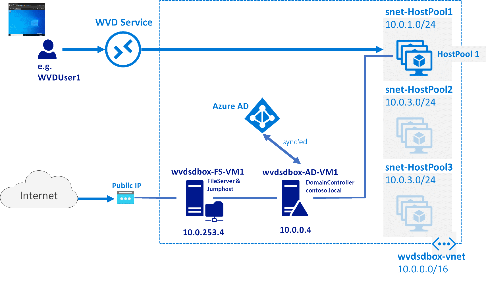

# My Windows Virtual Desktop (WVD) sandbox...
  
_...is about **build**ing **a**n Azure based **WVD demo** environment for fast evaluation, testing, learning, PoCs, ..._  
_...**is green-field** - i.e. scripts are **not** intended **for subscriptions where AAD is already sync'ed to an AD**..._  
_...should **save you time** on things you are not interested (=**building prerequisites**) and give you more **to focus on WVD**._  

**Facts**: 
* This is self-paced learning.
* Duration: i.e. Time to WVD sandbox = approx. x minutes
* Latest successful run: 
* WVD version: works with the current WVD build
* Automation done using PowerShell, Azure ARM Templates, Azure VM Custom Script Extensions  -> all stored in the BaseSetupArtefacts folder

> **Disclaimer**: Practices shown here are in **no way** best practices. **Focus of this lab is functionality & speed**.  
Beware that some assumptions have been made that will | might not be suitable for your real life environment.  
Nevertheless exercising this repo hopefully gives insights why things are different in real scenarios.  
So ride at your own risk and please use your brain ;-)  

## The WVD Sandbox Demo Environment
**Windows Virtual Desktop provides you access to a Windows desktop** where you need it (via https) on a large variety of devices (e.g. PC, Mac, Android, iPhone, linux thin clients)
The **desktops are spun up in your subscription** and controlled by you (vm size, capabilities, applications, work hours). **Backend services** (e.g. load balancing) **are managed by Microsoft**.  
This is **the architecture you will get** when deploying the WVD sandbox:  
  

  
**Explanation:**
* **wvdsdbox-AD-VM1** is a W2k19 domain controller ('contoso.local') that has an OU (organizational unit) for WVD + some test users. This OU will be sync'ed with the AAD your Azure subscription is mapped to.
* **wvdsdbox-FS-VM1** a W2k19 member server as jump host (i.e. has a public IP address) with an additional disk that can be used for administration or to provide a file share for user profile data.  
* **You will create a host pool** with session hosts in a pre-provisioned subnet. Once the host pool is ready **you configure** the application or desktop **access**.  
* After that users e.g. WVDUser1@_yourAADdomain_.onmicrosoft.com can then **use e.g. the web portal to connect to** his workspace: application or **desktop**. 

## The WVD Sandbox Setup  
- [Challenge 1: A foreword: Or single subscription deployment vs. split subscription deployment ](/SetupChallenges/Challenge1/README.md)  
Some reading about the prerequisites - screenshots of the result - when it makes sense to do a split subscription setup of WVD.
- [Challenge 2: Setup Basics i.e. Network, Domain Contoso And Member File Server](/SetupChallenges/Challenge2/README.md)  
This will do the work of setting up the base requirements - it contains powershell code that'll deploy vms to your subscription.
- [Challenge 3: Do AAD Sync using AD Connect](/SetupChallenges/Challenge3/README.md)  
A screenshot story to guides you through the process of syncing user accounts in Active Directory for use with Azure Active Directory.
- [Challenge 4: Create A Host Pool](/SetupChallenges/Challenge5/README.md)
- [Challenge 5: Manage Application Group](/SetupChallenges/Challenge6/README.md)
- [Challenge 6: Test from client](/SetupChallenges/Challenge7/README.md)
- [Challenge X: What's next?](/SetupChallenges/Challenge7/README.md)

## Want to delete the wvd sandbox?  
[Please go here for the cleanup routine](/CleanupChallenge/README.md)

## What the heck... 
...you may ask why do I:
1. [_Need a domain controller in this scenario?_](#The%20DC%20is%20used%20for...)
2. [_What is the file server used for?_](#The%20File%20Server%20is%20used%20as...)

### The DC is used for...
In WVD a user is connecting to a desktop machine - this is a domain joined VM with a Windows OS on it. Hence the VM (aka 'Session Host') is domain joined on creation and therefore we need a DC.  
Under real life circumstances this DC would probably be installed in a VM in Azure that is syncing / replicating via a private Tunnel (S2S VPN | ExpressRoute) to an onpremise Domain Controller.  
Alternatively possible but fewer used is the Azure AD Domain Services feature (= 'AD as PaaS') in Azure.  
[back](#%20What%20the%20heck...) 

### The File Server is used as...
... a destination for profile data to be written to. Which profiles? Well, each user logging onto a Windows OS gets various profile folders (e.g. Documents, Pictures, Downloads,...). Content placed there should _'travel'_ with the user - as the user might catch a different VM (aka 'Session Host') at next logon.  
FSLogix - an aquisition Microsoft did recently provides tools that redirect profile data to a e.g. remote file share.  
[back](#%20What%20the%20heck...) 

I know there is already loads of content out there. Nevertheless I hope this saves you some time.  
Feedback welcome!  

Best,  
Bernhard
