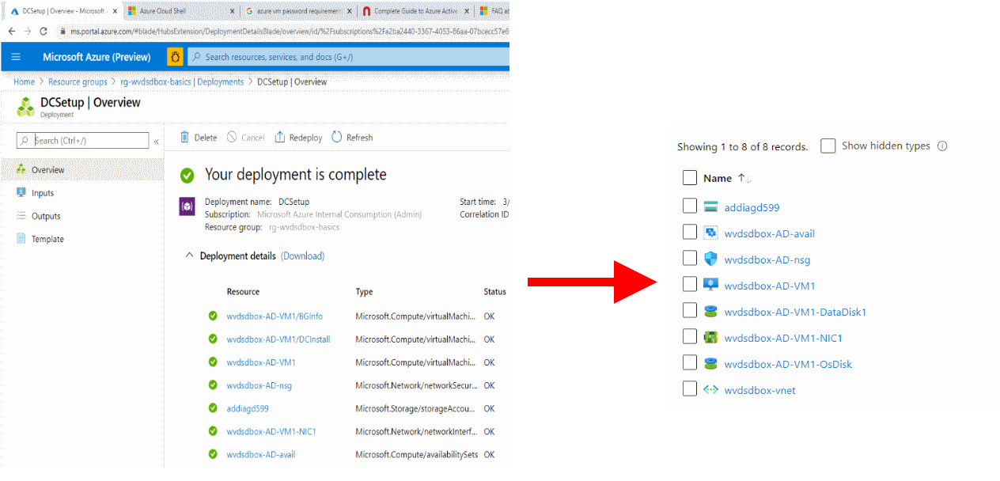
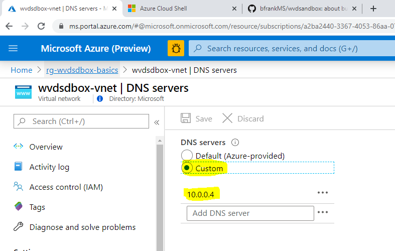
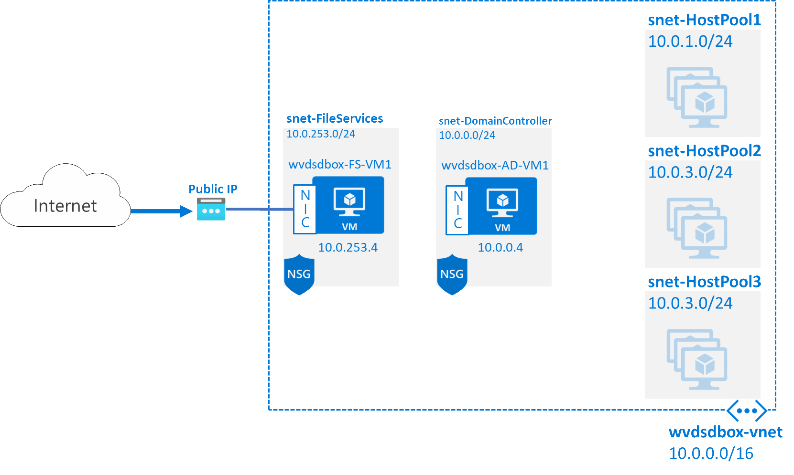

# Challenge 0: Setup Basics i.e. Network, Domain Contoso And Member File Server 

[back](../README.md)

In this challenge we will setup the basics requied for the WVD Sandbox. In order to save time we will use the Azure Cloud Shell to run some PowerShell code.  
> **Note**: With the use of Azure Cloud Shell we don't need to install something on your local box. No version conflics. And you are already authenticated at Azure ;-)

## 0. Create an Azure Cloud Shell - if you don't have one. :-)
```
[Azure Portal] -> Click the 'Cloud Shell' symbol close to your login details on the right upper corner.
```  
)  
The **'Cloud Shell' is an in-browser-accessible shell for managing Azure resources**. It already has the required SDKs and tools installed to interact with Azure. You can use either Bash or PowerShell.  
When being asked **choose PowerShell this time**.  
**The first time you use the 'Cloud Shell' you will be asked to setup a storage account** e.g. to store files you have uploaded persistently. [See](https://docs.microsoft.com/en-us/azure/cloud-shell/persisting-shell-storage)  

```
[Azure Portal] -> Click 'Show advanced settings'
```  
  

| Name | Value |
|---|---|
| Subscription  |  _your subscription_ |
| Cloud Shell Region  |  e.g. **West Europe** |   
| Resource Group  |  e.g. **rg-cloudshell** |   
| Storage Account  |  **_some unique value_** |   
| File Share  |  **cloudshell**|   

```
[Azure Portal] -> Create storage
```  
Once successful your shell should appear at the bottom of the page:  


## 1. Let's create some Resource Groups
Make sure you are using the right subscription, e.g. 
```PowerShell
Get-AzContext  
```  
Now, are you **using the right subscription**? 
> **If not**: To use a different subscription to deploy to you might try:  
>```PowerShell
>Get-AzSubscription 
>
>Set-AzContext -Subscription '%SubscriptionName%' 
>```  

Now let's **create some Resource Groups copy & paste the following code into the Cloud Shell**:  
```PowerShell
$RGPrefix = "rg-wvdsdbox-"
$RGSuffixes = @("basics","hostpool-1","hostpool-2","hostpool-3")
$RGLocation = 'westeurope'   # for alternatives try: 'Get-AzLocation | ft Location'

foreach ($RGSuffix in $RGSuffixes)
{
   New-AzResourceGroup -Name "$($RGPrefix)$($RGSuffix)" -Location $RGLocation
}
```  
As result you should get something like:  


## 2. Create the Network and Domain Controller.  
The following script deploys the **network** and the **domain controller** into the the 'rg-wvdsdbox-basics' resource group.  
Please **copy & paste this script into your Cloud Shell**:  

```PowerShell
New-AzResourceGroupDeployment -ResourceGroupName 'rg-wvdsdbox-basics' -Name 'NetworkSetup' -Mode Incremental -TemplateUri 'https://raw.githubusercontent.com/bfrankMS/wvdsandbox/master/BaseSetupArtefacts/01-ARM_Network.json'

# These are some parameters for the dc deployment
$templateParameterObject = @{
'vmName' =  [string] 'wvdsdbox-AD-VM1'
'adminUser'= [string] 'wvdadmin'
'adminPassword' = [securestring]$(Read-Host -AsSecureString -Prompt "Please enter a password for the vm and domain admin.")
'vmSize'=[string] 'Standard_F2s'
'DiskSku' = [string] 'StandardSSD_LRS'
'DomainName' = [string] 'contoso.local'
}
New-AzResourceGroupDeployment -ResourceGroupName 'rg-wvdsdbox-basics' -Name 'DCSetup' -Mode Incremental -TemplateUri 'https://raw.githubusercontent.com/bfrankMS/wvdsandbox/master/BaseSetupArtefacts/02-ARM_AD.json' -TemplateParameterObject $templateParameterObject

#Restart DC
Restart-AzVM -Name $($templateParameterObject.vmName) -ResourceGroupName 'rg-wvdsdbox-basics' 

#cleanup: remove 'DCInstall' extension
Remove-AzVMCustomScriptExtension -Name 'DCInstall' -VMName $($templateParameterObject.vmName) -ResourceGroupName 'rg-wvdsdbox-basics' -Force  

#Do post AD installation steps: e.g. create OUs and some WVD Demo Users.
Set-AzVMCustomScriptExtension -Name 'PostDCActions' -VMName $($templateParameterObject.vmName) -ResourceGroupName 'rg-wvdsdbox-basics' -Location (Get-AzVM -ResourceGroupName 'rg-wvdsdbox-basics' -Name $($templateParameterObject.vmName)).Location -Run 'CSE_AD_Post.ps1' -Argument "WVD $($templateParameterObject.adminPassword)" -FileUri 'https://raw.githubusercontent.com/bfrankMS/wvdsandbox/master/BaseSetupArtefacts/CSE_AD_Post.ps1'  
  
#Cleanup
Remove-AzVMCustomScriptExtension -Name 'PostDCActions' -VMName $($templateParameterObject.vmName) -ResourceGroupName 'rg-wvdsdbox-basics' -Force -NoWait  
  
#make sure DC is new DNS server in this VNET  
az network vnet update -g 'rg-wvdsdbox-basics' -n 'wvdsdbox-vnet' --dns-servers 10.0.0.4  
  

```
> **Note**: The **password** used above needs to be **complex enough** - pls see [here](https://docs.microsoft.com/en-us/azure/virtual-machines/windows/faq#what-are-the-password-requirements-when-creating-a-vm) for details.

The deployment will take some time (20mins?) - please be patient. The result should look similar to this:  
  

## 3. Make the created DC the DNS Server of the VNET  
**This is very important**: The fileserver and the host Pool VMs (aka 'Session Hosts') **will join the previously created domain**.  
In order **to find the DC** we'll have to make sure the **DC's IP is listed in the VNETs DNS Servers**.:  
  
  


## 4. Create the File server.  
The following code deploys the **file server** into the the 'rg-wvdsdbox-basics' resource group.  
Please **copy & paste this script into your Cloud Shell**:    
```PowerShell
# These are some parameters for the File Server deployment
$templateParameterObject = @{
'vmName' =  [string] 'wvdsdbox-FS-VM1'
'adminUser'= [string] 'wvdadmin'
'adminPassword' = [securestring]$(Read-Host -AsSecureString -Prompt "Please enter a password for the vm and domain admin.")
'vmSize'=[string] 'Standard_F2s'
'DiskSku' = [string] 'StandardSSD_LRS'
'DomainName' = [string] 'contoso.local'
}
New-AzResourceGroupDeployment -ResourceGroupName 'rg-wvdsdbox-basics' -Name 'FileServerSetup' -Mode Incremental -TemplateUri 'https://raw.githubusercontent.com/bfrankMS/wvdsandbox/master/BaseSetupArtefacts/03-ARM_FS.json' -TemplateParameterObject $templateParameterObject

# make this server a file server.
Set-AzVMCustomScriptExtension -Name 'FileServerInstall' -VMName $($templateParameterObject.vmName) -ResourceGroupName 'rg-wvdsdbox-basics' -Location (Get-AzVM -ResourceGroupName 'rg-wvdsdbox-basics' -Name $($templateParameterObject.vmName)).Location -Run 'CSE_FS.ps1' -FileUri 'https://raw.githubusercontent.com/bfrankMS/wvdsandbox/master/BaseSetupArtefacts/CSE_FS.ps1' 

#Cleanup
Remove-AzVMCustomScriptExtension -Name 'FileServerInstall' -VMName $($templateParameterObject.vmName) -ResourceGroupName 'rg-wvdsdbox-basics' -Force -NoWait  
  
```  
## 5. Conclusion  
If everything went well you should have 2 servers as azure vms that build up a domain (_contoso.local_):  

  
The **main artefacts and purposes** are:  

|Name  | Type | Description |
|--|--|--|
| wvdsdbox-AD-VM1 |  VM | <ul><li>IP: 10.0.0.4</li><li>DController 'contoso_local', DNS</li><li>has testusers (WVDUser1, WVDUser2...) in OU ('WVD')</li></ul> |
| wvdsdbox-FS-VM1 | VM  | <ul><li>IP:10.0.253.4</li><li>Fileserver, Jumpserver</li><li>member of contoso.local</li><li>has public IP for remote administration</li><li>can host fileshares for FSLogix profiles ('\\\wvdsdbox-FS-VM1\Profiles0')</li></ul>|
|wvdsdbox-vnet  | virtual network |  <ul><li>AddressRange: 10.0.0.0/16</li><li>DNS: 10.0.0.4</li><li>has subnets for WVD:<ul><li>snet-HostPool1 (10.0.1.0/24)</li><li>snet-HostPool2 (10.0.2.0/24)</li><li>snet-HostPool3 (10.0.3.0/24)</li></ul></li></ul>   |
  
[back](../README.md) 