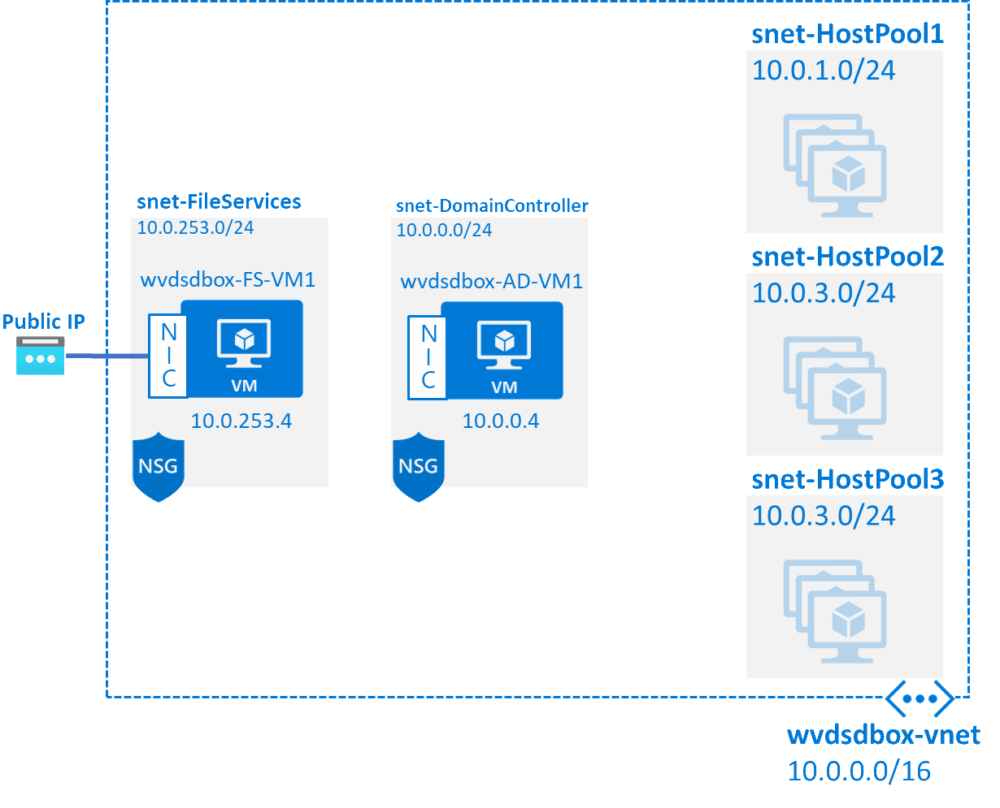
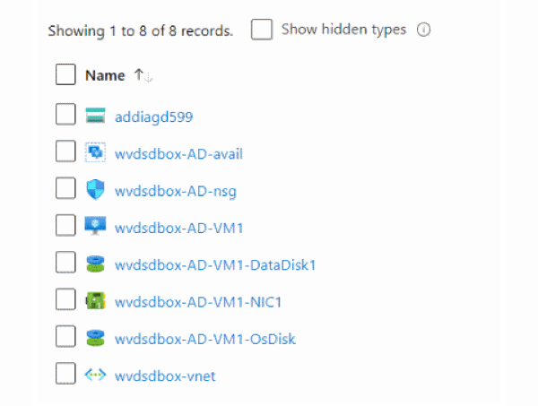
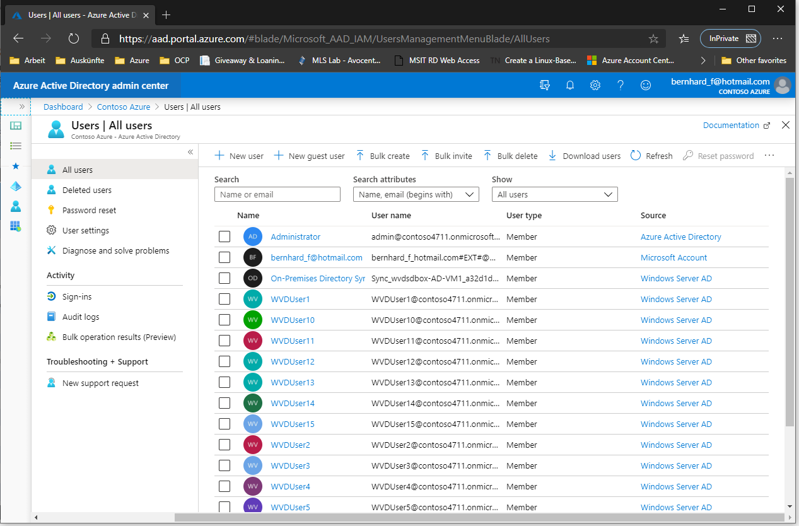
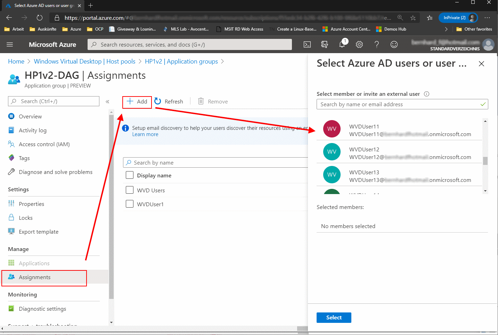
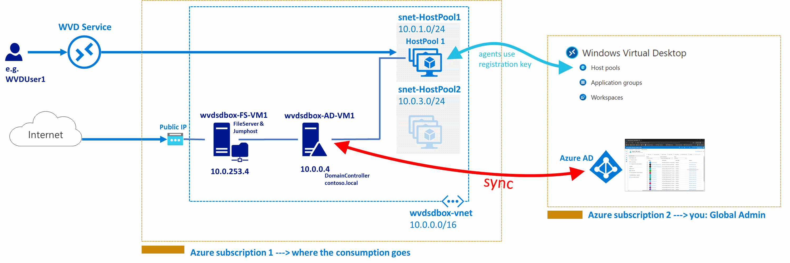

# Challenge 1: A foreword: _Or single subscription deployment vs. split subscription deployment_

[back](../../README.md)

Let's talk about some prerequisites. WVD needs:
- Low brainer: **An active Azure subscription** ;-)
- You need **an Active Directory accessible from your Azure subscription**. Why? Because the desktops will do a domain join. This is a current WVD requirement. The wvd sandbox will deploy an AD (contoso.local) for you.
- **Azure Active Directory that is sync'ed with the above Active directory**. Why? Because the users who access WVD need to logon with AAD credentials + AD credentials (**not** **_single sign on_** but **_'same sign on'_**). You'll do the AD sync in one of the WVD sandbox challenges.

## What you'll get - some screenshots:  
- **After challenge2** you will have some vms in your azure subscription (DC, Jumphost, Network):  

|   |  |
|--|--|
 
- **After challenge3** you will have user accounts in your AAD that you can assign permissions to access WVDesktops:  
  

- **In Challenge4** you create a WVD Host Pool:  
**Session Host**: Is a vm in your subscription a user is connected to. It serves as a desktop in your WVD environment. It can be a Windows Client (e.g. Windows 10 OS) or Windows Server. A session host has agents on it that connect it to the WVD backend.  
**Host Pool**: Is a group of Session Hosts that have identical configuration intented to serve the same group of users.  
  

- In **Challenge5** you create an Application Group  
**Application Group**: A WVD object that defines what the - applications, desktops, user assignment.

- In Challenge X: You connect from a client.

Workspace:

## Single subscription deployment versus split subscription deployment.  
When you allow users to access desktops (or applications) via the portal you make an assignment:  
  
**Note**: The **users you can select from are in the same 'realm' as the WVD configuration**.  
**But what if you want different users, groups from a different AD to access session hosts?**    
**Why?** **Probably** because **you want to test** and **don't mess with your existing AAD** (were you may lack permissions anyway) - or you want to split the consumption / billing amongst multiple subscriptions.  
**Can I have users from a different AD/AAD be accessing my host pool?**  

**Yes**, you'll need to **setup your WVD config with AAD in subscription 2** and **setup manually the vms in subscription 1** and **configure the agents in the session hosts to register with the WVD Hostpool in subscription 2**  
|pros | cons |
|--|--| 
| <ul><li>split bill possible</li><li>circumvent AAD permission shortage</li></ul>| <ul><li>you need 2 active subscriptions</li><li>no single pane of glass management</li><li>cannot use portal to setup session hosts (manual)</li></ul> |

  

[next](../Challenge2/README.md) 
