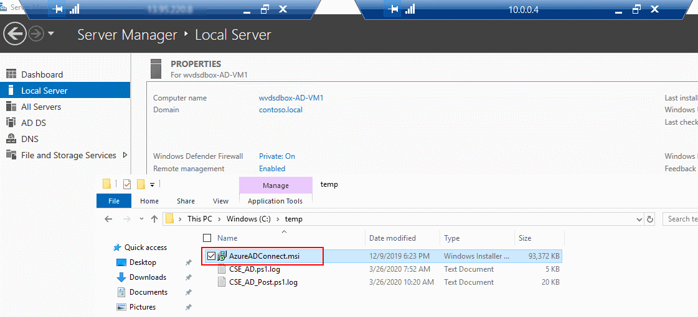

# Challenge 1: Do AAD Sync using AD Connect  

[back](../README.md)  
  
In this challenge you'll implement hybrid identity by sync'ing your AD users to your Azure AD (AAD).  
So the final result of this exercise should look like:  
  

## 0. Choose the AAD you want to sync to (i.e. _destination_)  
**Important**:
1. You should **not sync** to your production **AAD**! (_at least if your are not sure what you are doing ;-)_)  
2. You **need to be** | know the **_Global administrator_** of your **AAD**!  

**Why?, Because:...**  
- ...your AAD may already be sync'ed with another domain.
- ...you need the rights to give consent to the WVD applications (e.g. to make auth work for WVD user.)  
  
Take a look at the current sync status of your AAD:  
```
[Azure Portal] -> Azure Active Directory
``` 
| <H3>Looks like this?</H3> | <H3>or like that?</H3> |
|--|--|
|   |   |
| Good to go! | **This AAD is sync'ing already**. You'll probably want to **create a new AAD** for the WVD sandbox. Go [here](Subchallenge/CreateANewAAD.md) for the instructions. |


## 1. Download and Install the AD Connect Tool.
Log on to your domain controller (_wvdsdbox-AD-VM1_) via the jumphost (_wvdsdbox-FS-VM1_):
```
Internet ---RDP---> wvdsdbox-FS-VM1 (Public IP) ---RDP---> DC ('10.0.0.4')
```  
On the DC you will find the AD Connect tool already downloaded: _"C:\temp\AzureADConnect.msi"_  
**Doubleclick to install AD Connect.**  


## 2. Implement AD Connect

## 3. Result


[back](../README.md) 