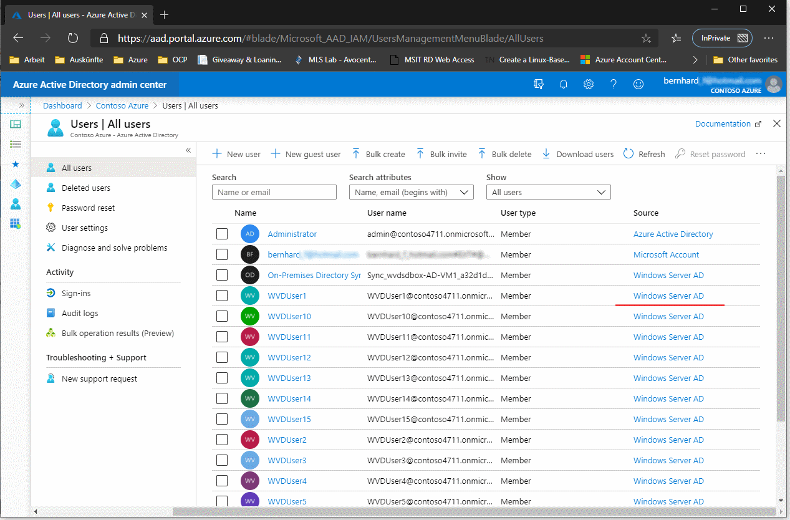
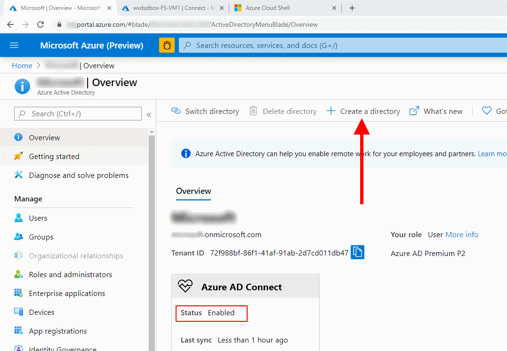
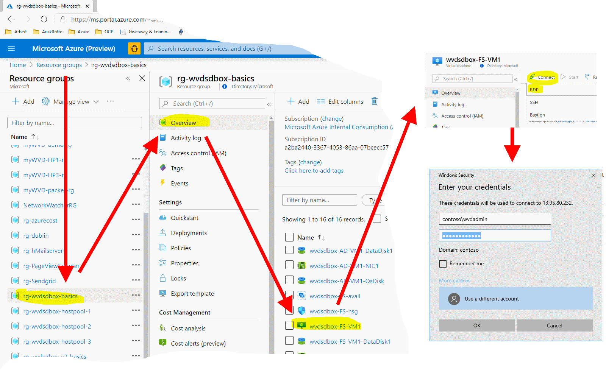
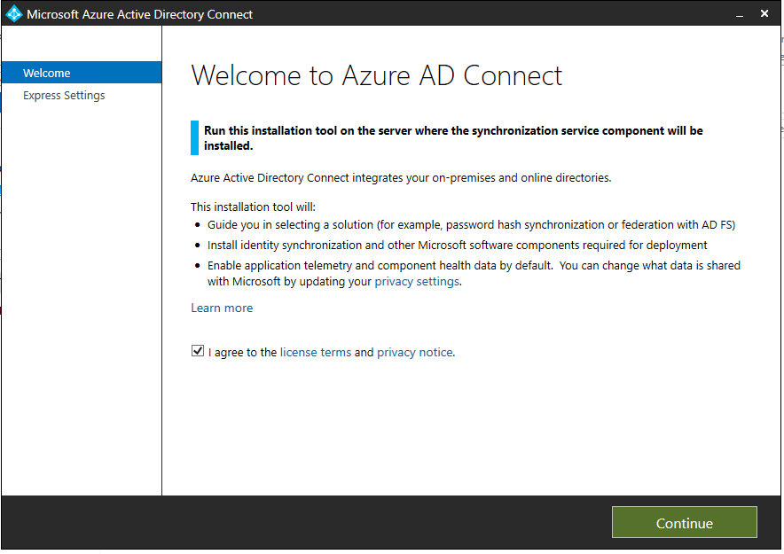
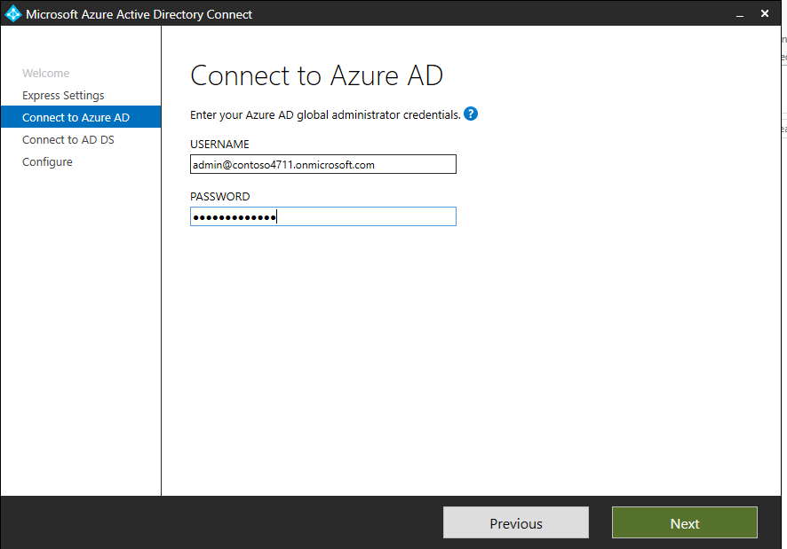
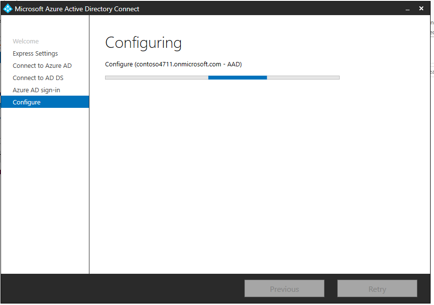
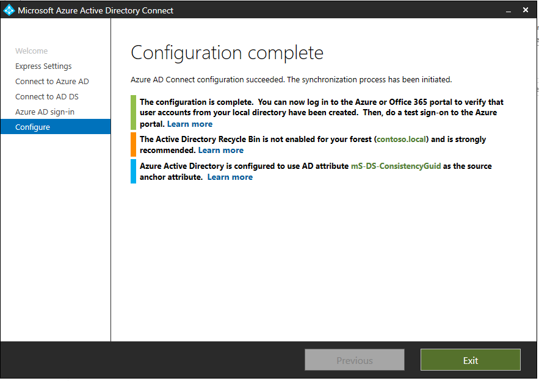

# Challenge 1: Do AAD Sync using AD Connect  

[back](../../README.md)
  
In this challenge you'll **implement hybrid identity by sync'ing your AD users to your Azure AD** (AAD).  
So the final result of this exercise should look like:  
  

## 0. Choose the AAD you want to sync to (i.e. _destination_)  
**Important**:
1. You should **not sync** to your production **AAD**! (_at least if your are not sure what you are doing ;-)_)  
2. You **need to be** | know the **_Global administrator_** of your **AAD**!  

**Why?, Because:...**  
- ...your AAD may already be sync'ed with another domain.
- ...you need the rights to configure the sync.
  
Take a look at the current sync status of your AAD:  
```
[Azure Portal] -> Azure Active Directory
``` 
| <H3>Looks like this?</H3> | <H3>or like that?</H3> |
|--|--|
|   |   |
| **Good to go!** | **This AAD is sync'ing already**. Maybe you'll want to do a split subscription deployment. Go [here](../Challenge1/README.md#single-subscription-deployment-versus-split-subscription-deployment) for the explanation. |


## 1. Download and Install the AD Connect Tool.
**Log on to your jumphost** (_wvdsdbox-FS-VM1_) via the azure portal:  
```
Internet ---RDP---> wvdsdbox-FS-VM1 (Public IP)
```  

**User:** contoso\wvdadmin  
**Pwd:** _%your password%_



In **the jumphost do a remote desktop connection ("double-hop") to your DC** ('10.0.0.4'). 
```
Internet ---RDP---> wvdsdbox-FS-VM1 (Public IP) ---RDP--->  DC ('10.0.0.4'). 
```   
**On the DC** you will find the **AD Connect** tool already downloaded: **_"C:\temp\AzureADConnect.msi"_**  
**Doubleclick to install AD Connect.**  

| 1. | 2. | 3. |
|--|--|--|
|  |   |  |
| On the DC install AD Connect | Hit **continue**  | **Use express settings** to speed things up.  |  

> **Note**: It is **not** a best practice to install AD Connect on a domain controller.

## 2. Implement AD Connect _(10min)_
Now - please follow the picture story and **create a new AAD**:

| 4. | 5. | 6. |
|--|--|--|
|   |   |   |
| Logon **to Azure AD (AAD) you want to sync to as global administrator** | Next: Specify your _onpremise_ **Domain Admin Credentials**  | To make our .local domain syncronize with AAD we need to **select the checkbox** - and hit **next**.<br>**Why?** _.local_ domains are not public, i.e. cannot be verified and are not routable. This is not optimal but is fine enough for our WVD sandbox. Go [here](https://docs.microsoft.com/en-us/office365/enterprise/prepare-a-non-routable-domain-for-directory-synchronization) for further details.  |


| 7. | 8. | 6. |
|--|--|--|
|   |   |   |
| See which **settings are assumed** when using **express config** | ...**wait a while**  | Hit **exit** to finalize setup.  |

## 3. Result
At the end of this setup your AAD should be synch'ed with your domain controller. To verify go to:
```
[Azure Portal] -> Azure Active Directory
```  
Your **AAD is in sync**: 
  
and the **users are showing up in azure**:
 

[next](../Challenge4/README.md) 