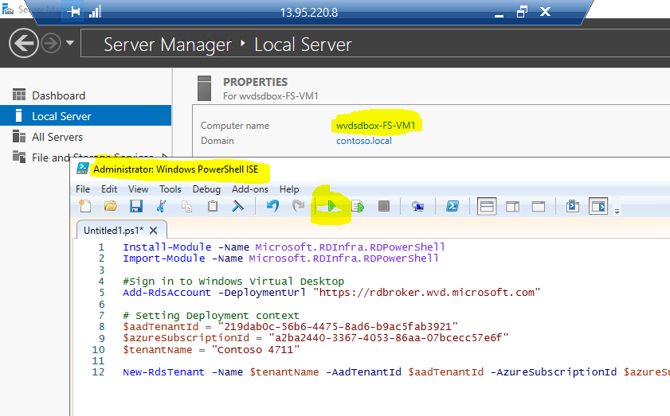
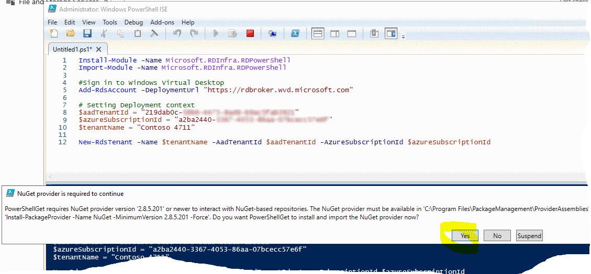
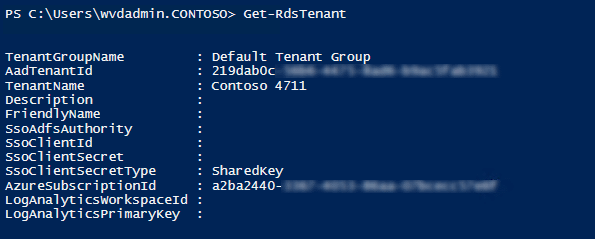

# Challenge 3: Create a WVD Tenant

[back](../README.md)

In the setup flow we are at position:  
  
  
For WVD we require a WVD Tenant. **The WVD tenant is not the same as an AAD Tenant**.  
However **they are _linked_ together**. So an WVD Tenant _belongs_ to an AAD.  
This challenge is about creating it and linking it together. The steps are done using PowerShell.  
  
**Copy & paste the following code into an code editor (or _notepad_)**:  
```PowerShell
Install-Module -Name Microsoft.RDInfra.RDPowerShell -Force
Import-Module -Name Microsoft.RDInfra.RDPowerShell 

#Sign in to Windows Virtual Desktop
Add-RdsAccount -DeploymentUrl "https://rdbroker.wvd.microsoft.com"

# Setting Deployment context
$aadTenantId = "< Azure Active Directory Directory ID >"
$azureSubscriptionId = "< Azure Subscription ID >"
$tenantName = "< Tenant Name >"

New-RdsTenant -Name $tenantName -AadTenantId $aadTenantId -AzureSubscriptionId $azureSubscriptionId 

```

>**Edit** the following variables:  

| variable | value |
|--|--|
| $aadTenantId | `[Azure Portal] -> Azure Active Directory-> TenantID`    |
| $azureSubscriptionId | `[Azure Portal] -> Subscriptions -> SubscriptionID`  |
| $tenantName | _enter a useful name here_ e.g. Contoso 4711 |


## Run Code In PowerShell
RDP into your jumpserver and open PowerShell ISE as Administrator to run the edited code:  
```
Internet ---RDP---> wvdsdbox-FS-VM1 (Public IP)
```  
> **Important**: You **cannot use the azure cloud shell** for this code (_is running PScore >= 7.0_). It **must be PowerShell version 5.1|5.0.**  

| 1. | 2. | 3. |
|--|--|--|
|  |  |  | 
| **Open PowerShell ISE on _wvdsdbox-FS-VM1_** and **paste the edited code** | **Run and confirm** modules to be installed | **Logon to your AAD** (the one that **you use for AD sync**'ing) as user with **Tenant Creator rights** <br>(in my case admin@contoso4711.onmicrosoft.com)  |  
  
## Result  
As a result the PowerShell should return similar outputs:  
|  |   
|--|--|
| **Success** message: A WVD administration context  | `Get-RDSTenant` should deliver something like this. |  
  

**Congrats! You successfully created a WVD Tenant.**
  

[back](../README.md)
