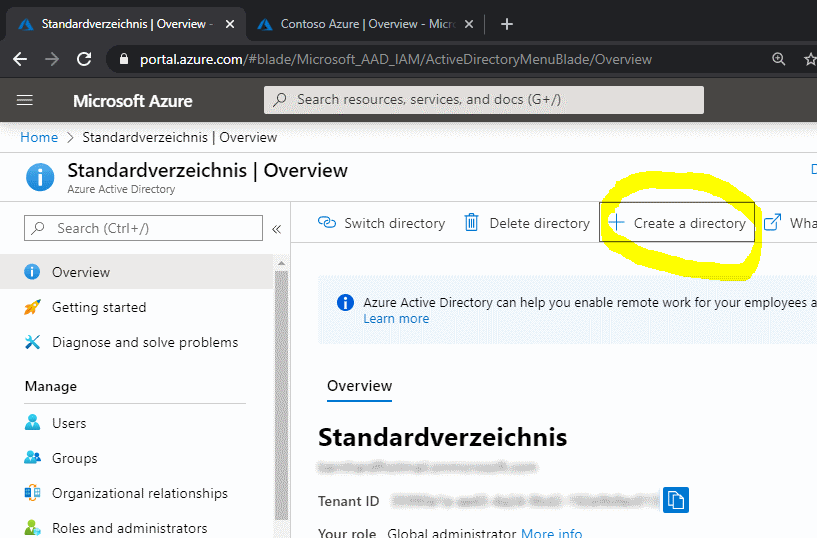
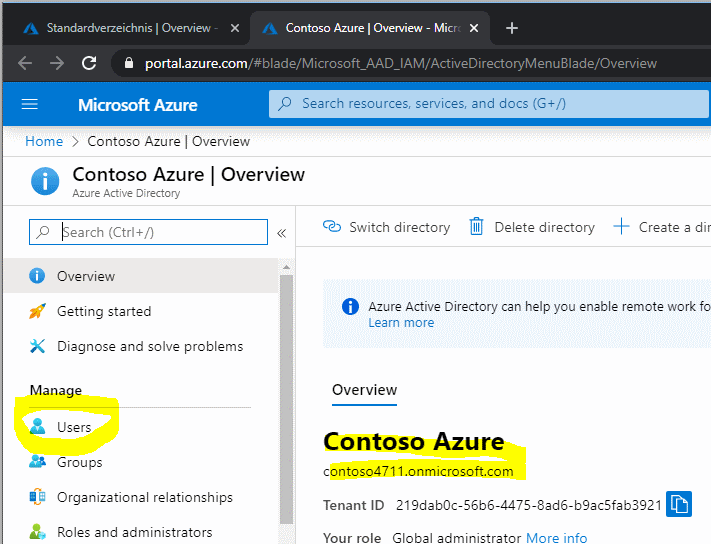

# SubChallenge: Create A New AAD To Be Used For WVD Sandbox.

[back](../README.md)  

Creating an AAD is easy and free of charge. Please find below the steps to create:
- a new AAD
- a new user that has global administrator rights.
- logon as this user and change the pwd.

## 1. Create A New AAD  
Go to:  
```
[Azure Portal] -> Azure Active Directory
``` 
Now - please follow the picture story and **create a new AAD**:  

| 1. | 2. | 3. |
|--|--|--|
|   |   |   |
| Create a directory | Select Azure Active Directory  | Create a _unique organization_  |


| 4. | 5. | 6. |
|--|--|--|
|   |   |   |
| Review and press **create** | ...**wait** a while  | **Click** on the **green link**  |
  

## 2. Create A New Global Administrator User  
| 6. | 7. | 8. |
|--|--|--|
|   |   |   |
| You should be redirected to your new AAD! </br>Go to **Users** | Create a **new user**  | <ul><li>Username: **admin**</li><li>Roles: **Global administrator**</li><li>**Show password and copy** for next logon</li></ul>  Hit **create** |  
  

| 9. | 10. | 11. |
|--|--|--|
|   |   |   |
| Use a **private browsing** session<br>(aka 'incognito' mode)<br>Login as admin@....onmicrosoft.com </br> | **Update** your **password**  | Clicking on the user window you should see your admin account |  

[back](../README.md) 