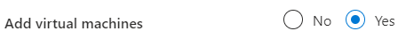
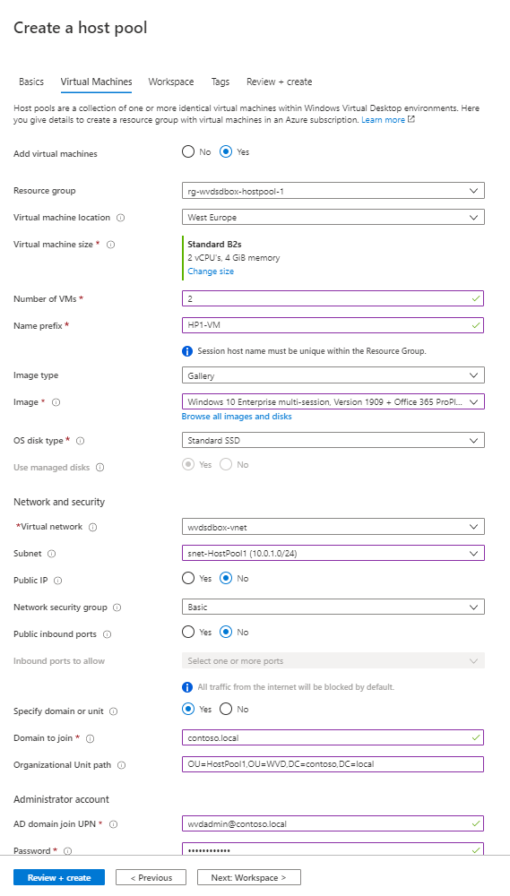
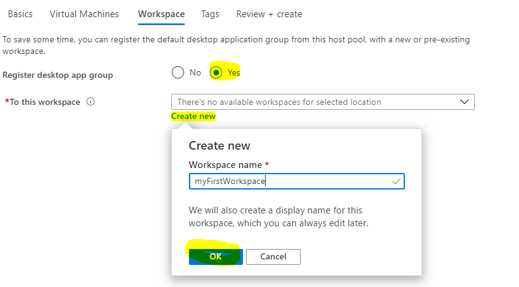
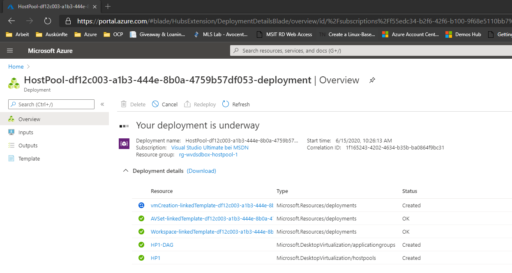

# Challenge 4: Create A WVD Host Pool 

[back](../../README.md)

## HostPool ##
_**A Session Host**_ : **Is a vm** in your subscription a user will connected to. It **serves as a desktop | application host** in your WVD environment. It can be a Windows Client (e.g. Windows 10 OS) or Windows Server. A session host has agents on it that connect it to the WVD backend.  
_**A Host Pool**_: Is a **collection of Session Hosts with identical configuration** intented to serve the same group of users.

**Follow the steps in the WVD** [Tutorial: Create a host pool with the Azure portal](https://docs.microsoft.com/en-us/azure/virtual-desktop/create-host-pools-azure-marketplace) and use the following values:

> **Important**: Beware to hit the **right** create host pool wizard - because there are 2 (Fall release and Spring Release WVD). To hit the right host pool wizard **[Azure Portal] -> Search resources... -> 'Windows Virtual Destop' -> Create a host pool**

| Name | Value |
|--|--|
| Resource group | **rg-wvdsdbox-hostpool-1** |
|Host pool name | **HP1**|
|Location |e.g. **East US**|
|Host pool type | **pooled**|
|Max session limit| e.g. **5** |
|Load balancing algorithm | **Breadth-first** |  

## Session Hosts ## 
Select **Yes** to add virtual machines as Session Hosts to this Host pool:  
  

Use the following values:  
| Name | Value |
|--|--|
| Resource group | **rg-wvdsdbox-hostpool-1** |
|Virtual machine location | **[the same region you used for rg-wvdsdbox... in Challenge2](../Challenge2/README.md)**|
|Virtual machine size |e.g. **Standard B2s**|
|Number of VMs | e.g. **2**|
|Name prefix| e.g. **HP1-VM** |
|Image type | **Gallery** | 
|Image  | e.g. **Windows 10 Enterprise multi-session,...+ Office 365 Pro...** |
|OS disk type| **Standard SSD** |
|Virtual network | **wvdsdbox-vnet** |
|Subnet| **snet-HostPool1**|
|Public IP| No |
|Network security group| Basic|
|Public inbound ports| No |
|Specify domain or unit| **Yes**|
|Domain to join| **contoso.local** |
|Organizational Unit path| **OU=HostPool1,OU=WVD,DC=contoso,DC=local**|
|AD domain join UPN| **wvdadmin@contoso.local**|
|Password|*********[that you used in setup at Challenge2](../Challenge2/README.md)|  
  

## Workspace ##  
 ["...A workspace is a logical grouping of application groups in Windows Virtual Desktop. Each Windows Virtual Desktop application group must be associated with a workspace for users to see the remote apps and desktops published to them..."](https://docs.microsoft.com/en-us/azure/virtual-desktop/environment-setup#workspaces)  
In the Workspace select **Yes** and **create** a workspace e.g. **myFirstWorkspace**:  
  

 
Hit **Review & Create** and create your Hostpool with VMs (= Session Hosts) &  Workspace. This will trigger a deployment that will take a while:  


## Result ##  
When the deployment finished successfully you should find 2 Session hosts in your new Host pool:  
```
[Azure Portal] --> Search: "Windows Virtual Desktop" --> Host pools --> "HP1" --> Session hosts -->
```
  
  
[next](../Challenge5/README.md) 
