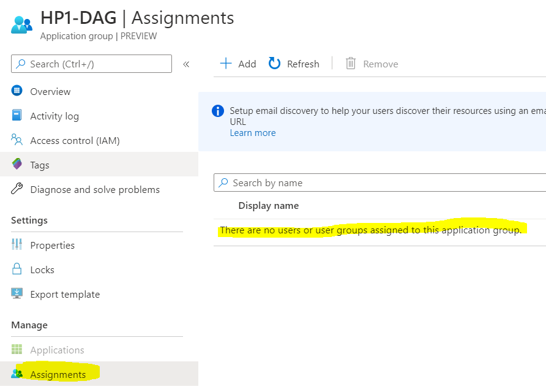
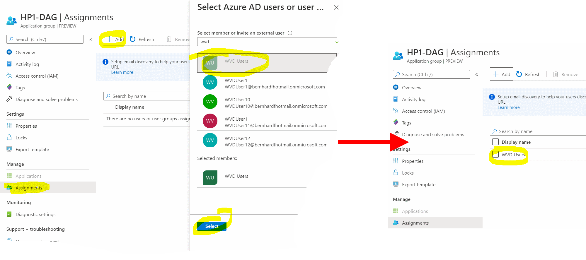

# Challenge 5: Enable Remote Desktop Access For Users

[back](../README.md)  

>**To allow users to connect to a desktop we first must assign a user to an application group.**  

_**Application Group**_: A WVD object that **defines which users or groups can access what applications or desktops**.  
An Application group is **assigned to a Host pool** and can either 'publish' applications (that are installed in the session host vms) or a desktop. **To make an app or desktop 'visible' to a user** you need to do **2** more **things**:  
- make a **user** | group **assignment**
- **register** this app group to a **workspace**.  
  
When **you created a host pool** in the previous challenge **a default app group was created with it** (e.g. "HP1-DAG" -> Host pool 1 default app group).  
**However no users are yet assigned to it**:  
```
[Azure Portal] --> Search: "Windows Virtual Desktop" --> Application groups --> "HP1-DAG" --> Assignments
```  


**Add the _'WVD Users'_ group to the app group:** 

  
Now **any user in this group should be allowed to access a desktop**. Let's test in the next challenge... 
  
[next](../Challenge6/README.md) 
