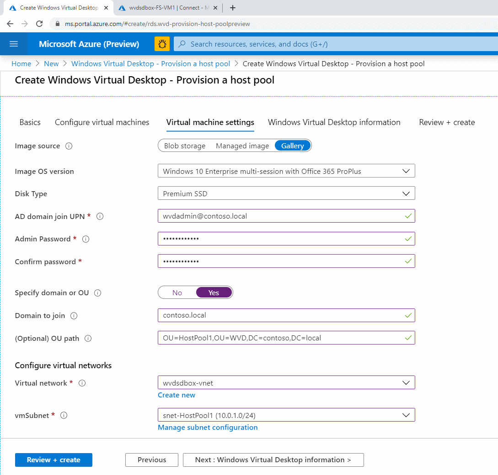
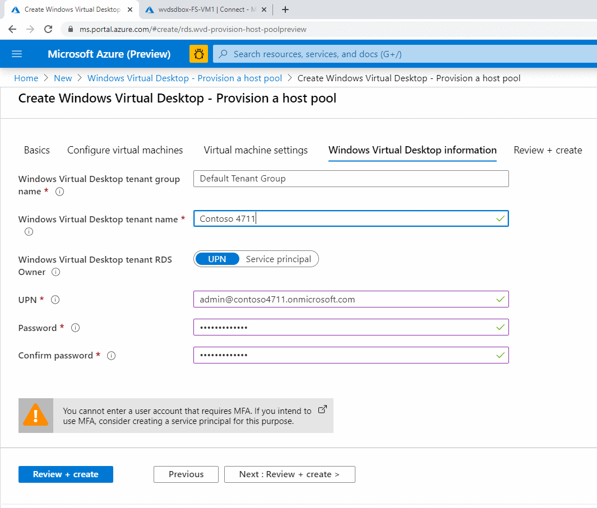
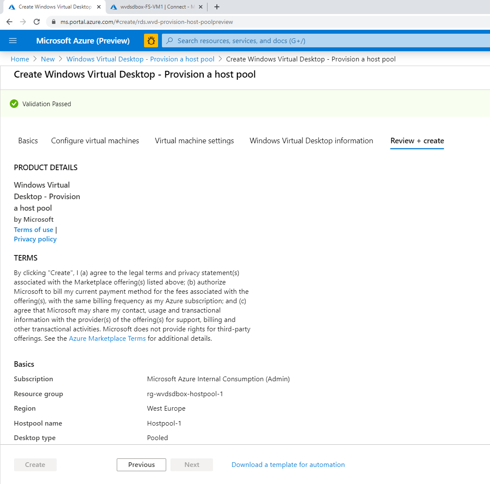

# Challenge 5: Create A Host Pool

[back](../README.md)  

You are here:  
  

See also [Tutorial: Create a host pool by using the Azure Marketplace](https://docs.microsoft.com/en-us/azure/virtual-desktop/create-host-pools-azure-marketplace)  

In this challenge we create the vms the WVD users are connecting to. These **vms are called _Session Hosts_**. One ore more **sesssion host are grouped together** and form a so-called '**Host Pool**'.  
**Members of a WVD host pool have the following in common:**
- VMs (aka '**Session hosts**') in a host pool **have same OS - Image**. Hence they have same set of applications installed.
- Session hosts are in the **same subnet**
- Share **same loadbalancing mechanism** (breadth, depth)
- Session hosts are either **pooled** (User will be loadbalanced to calculated host) or **persistent** (User gets same desktop he used before)
- Session hosts are domain joined to same AD Organizational Unit

You can have 1 or more host pools in your WVD environment.  
 
## Create A Host Pool Using The Azure Portal
For ease of use we use the Azure portal for creating a host pool:  
```
[Azure Portal] ---> '+' Create a resource ---> 'Windows Virtual Desktop - Provision a host pool' ---> 'Create'
```  

| 1. | 2. | 3. |
|--|--|--|
|   |  |  |
| <ul><li>Resource Group : **rg-wvdsdbox-hostpool-1** </li><li>Region: **West Europe** </li><li>HostPool Name: **Hostpool-1**</li></ul> | <ul><li>Usage Profile: **Custom** </li><li>Number of virtual machines: **2** </li><li>Virtual machine size: _e.g. B2ms_</li><li>Virtual machine name prefix: **HP1-VM**</li></ul>  | <ul><li>AD domain join UPN: **wvdadmin@contoso.local** </li><li>_Password_: _Your wvdadmin password_ (see [Challenge 0](../Challenge0/README.md)) </li><li>Specify domain or OU: **YES**</li><li>Domain to join: **contoso.local**</li><li>(Optional) OU path: **OU=HostPool1,OU=WVD,DC=contoso,DC=local**</li><li>virtual network: **wvdsdbox-vnet**</li><li>subnet: **snet-HostPool1**</li></ul> |  
  

| 4. | 5. | 6. |
|--|--|--|
|   |  |  |
| <ul><li>Windows Virtual Desktop tenant name: **_The tenant you created in [Challenge3](../Challenge3/README.md) (in my case 'Contoso 4711')_**  </li><li>UPN: _your **AAD Tenant Creator user** (in my case 'admin@contoso4711.onmicrosoft.com')_</li><li>Password: **_the tenant creators password_**</li></ul> | Verify and **Create**  | See the deployment process.  |  
  
## As Result...
you should have 2 session hosts in your resource group with are domain joined:  
| |  |  |
|--|--|--|
| Successful deployment | **Resource group contains the** VMs of the hostpool (aka '**Session hosts**')  | Session hosts are domain joined to specified OU|
  
**Congrats! You successfully deployed a host pool and some session hosts.**
  

[back](../README.md) 