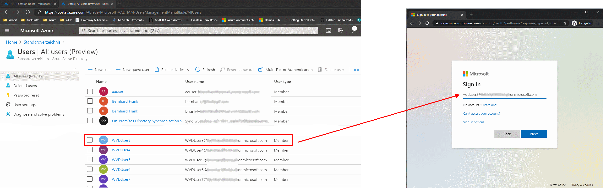
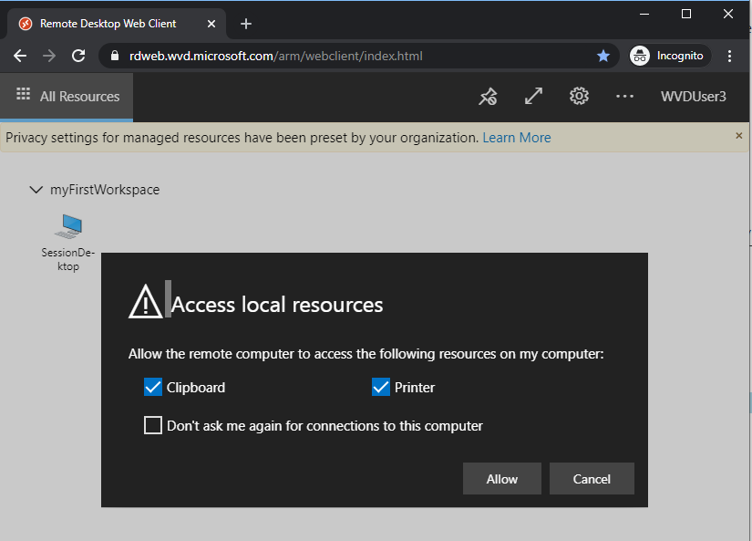
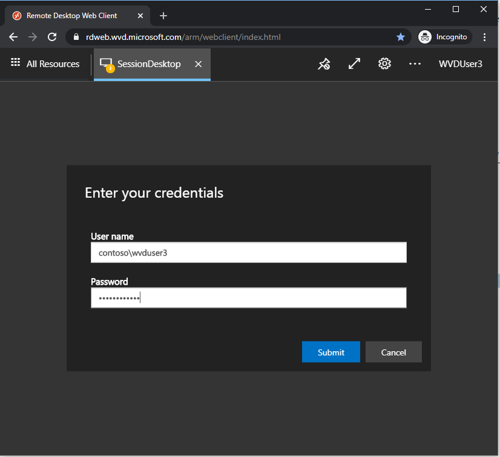
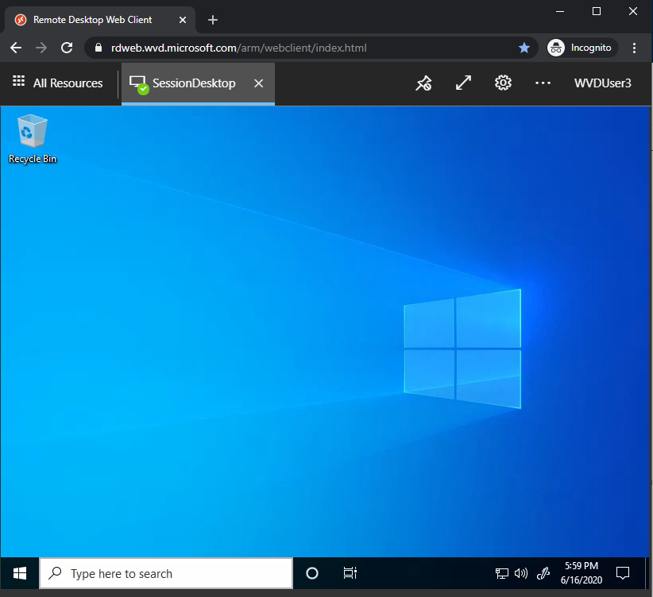

# Challenge 6: Test Remote Desktop Access With A User Via the Web Portal

[back](../../README.md) 
  
WVD brings a [Web Portal at a public internet facing address](https://rdweb.wvd.microsoft.com/arm/webclient/index.html) that any WVD user can use to access his desktops | applications.

In Challenge 5 we allowed any user in group 'WVD Users' to access a desktop. Let's just look into your AAD to select a user we will use for testing.  
```
[Azure Portal] --> Azure Active Directory --> Users
```  

I chose WVDUser3 to logon at the [WVD Web Portal](https://rdweb.wvd.microsoft.com/arm/webclient/index.html)
  
  
> Note: You may need to use a private (or incognito mode) browsing session to avoid auto logon.  
> **Note++**: The **users password** is the same that **you used for the wvdadmin** (the setup in [Challenge2](../Challenge2/README.md))   

Once successful you should see your **myFirstWorkspace**:  
  
  

|  |  |  |
|--|--|--|
| Doubleclick on the session desktop  | Logon to the destkop using the domain credentials:<ul><li><b>contoso\wvduser3</b></li><li><i>password that you used for the wvdadmin [in Challenge2](../Challenge2/README.md)</i></li></ul>  | On success you have a desktop within your browser |  
  
**Congratulations** You now have a working WVD sandbox.
 
[next](../ChallengeX/README.md)