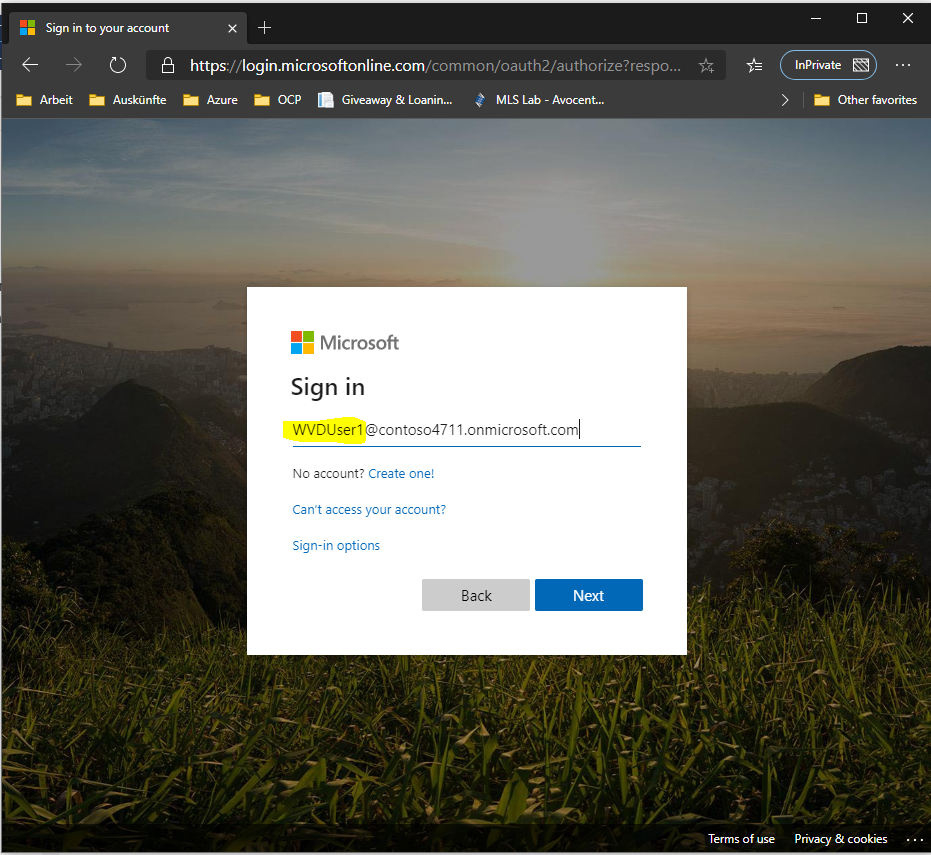

# Challenge 7: Test from client

[back](../README.md)  
  
You are here:  
  

Finally we are **ready to test**!  
Please note that there are **several ways to access the desktop**. A user can connect with the...
- [Windows Desktop client](https://docs.microsoft.com/en-us/azure/virtual-desktop/connect-windows-7-and-10)
- [WVD Web Client Access](https://rdweb.wvd.microsoft.com/webclient/index.html)
- [Android client](https://docs.microsoft.com/en-us/azure/virtual-desktop/connect-android)
- [macOS client](https://docs.microsoft.com/en-us/azure/virtual-desktop/connect-macos)
- [iOS client](https://docs.microsoft.com/en-us/azure/virtual-desktop/connect-ios)  

In this challenge **you can test the web client** for the user you allowed access to the Desktop Application Group in the previous [Challenge6](../Challenge6/README.md)  
  
## Test Using The Web Client Access.
Using the **web client is ideal if** the user accessing the desktop | application **cannot install any software**. The WVD acccess is **available in the internet**.  
**Open** a **private** | incognito **web browser window and navigate** to **https://rdweb.wvd.microsoft.com/webclient/index.html**.  

| 1. | 2. | 3. |
|--|--|--|
|   |  |  |
| Login using **your AAD user credentials** you added to the _Desktop Application Group_ in the previous [Challenge6](../Challenge6/README.md) _(in my case 'WVDUser1@contoso4711.onmi...')_  | **Logon** using the **same password** you used in [Challenge0 -> 2.](../Challenge0/README.md) **for the contoso\wvdadmin** user.  | After successful logon you should **see your allowed desktops** or applications  |

| 4. | 5. | 6. |
|--|--|--|
|   |  |  |
| Double**click on 'HostPool1'** and **allow** printer and clipboard redirection.  | **Logon** to the desktop using the contoso domain credentials for user you added to the _Desktop Application Group_ with the **same password** as the **the wvdadmin** user. (in my case 'contoso\wvduser1'...) | After successful logon **you should see your desktop**. |  
  
**Congrats! You made it! You now have a basic WVD setup up and running.**  

## What's next?  
You **may** now **try** the following:  
- **Customize you image**. e.g. install: language pack, keyboard layout, time zone, applications and publish applications in an application group rather than full desktops.
- **Implement profile folder redirection using FSLogix**. Install FSLogix onto the session hosts and configure it to redirect profiles to the fileserver (our jumphost). [See](https://docs.microsoft.com/en-us/fslogix/configure-profile-container-tutorial)
- **[Implement FSLogix Application Masking](https://docs.microsoft.com/en-us/fslogix/implement-application-masking-tutorial)**
- **Configure WVD Monitoring** using Log Analytics. [See](https://docs.microsoft.com/en-us/azure/virtual-desktop/diagnostics-log-analytics)
- **[Scale session hosts using Azure Automation](https://docs.microsoft.com/en-us/azure/virtual-desktop/set-up-scaling-script)**
- Implement **3rd party tools from sepago** (Monitoring, autoscale, User self service, Azure Admin for WVD) - go [here](https://www.sepago.de/en/wvd-value-add-tools/)
...

  
[back](../README.md) 