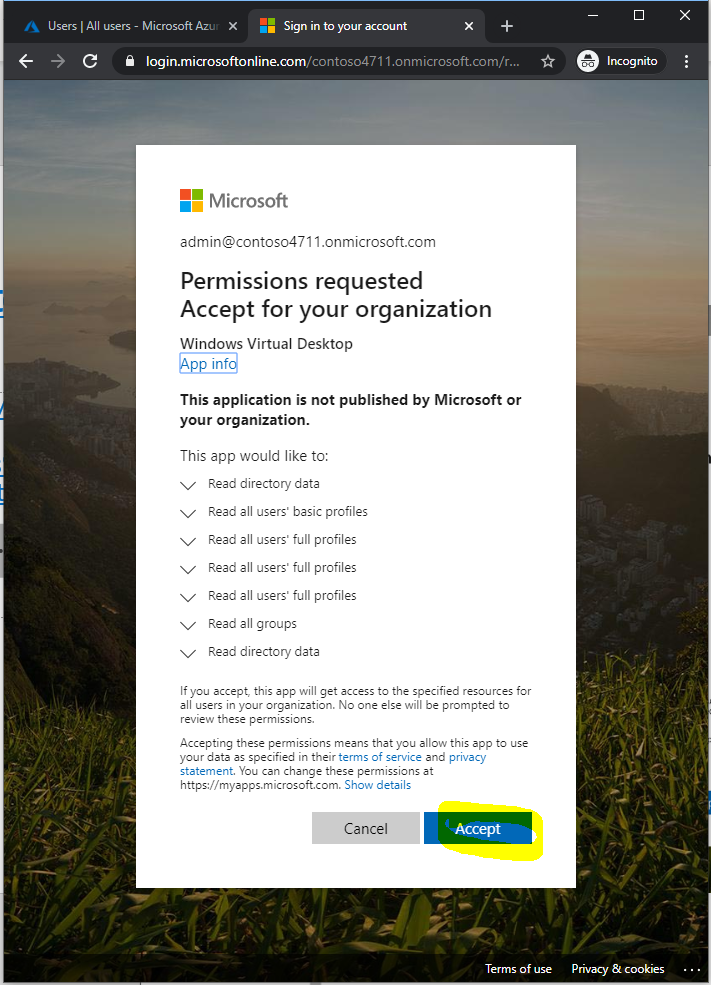
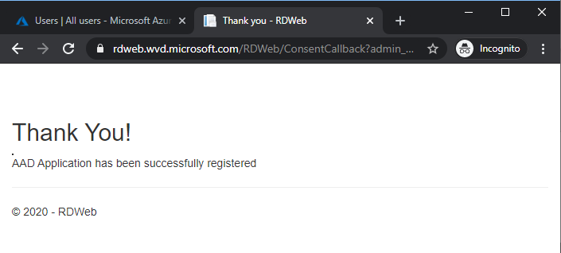
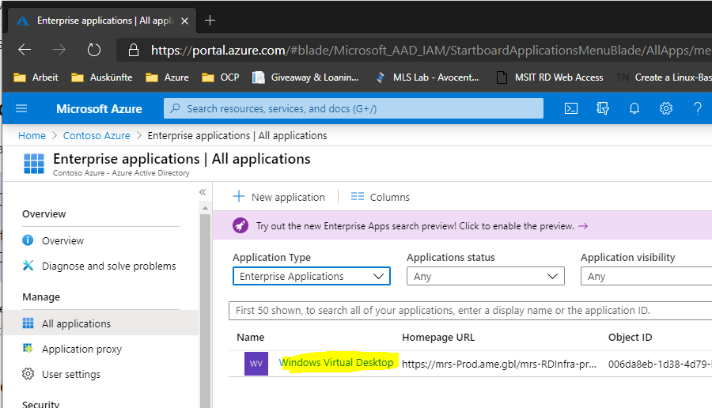
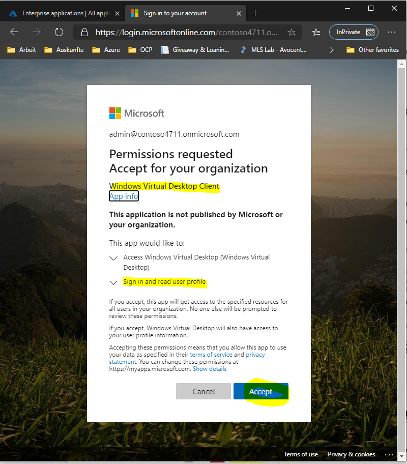
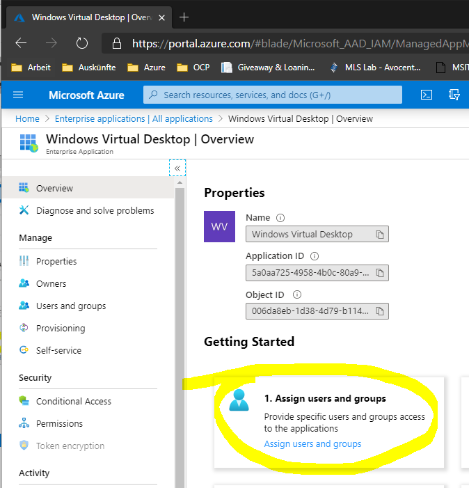
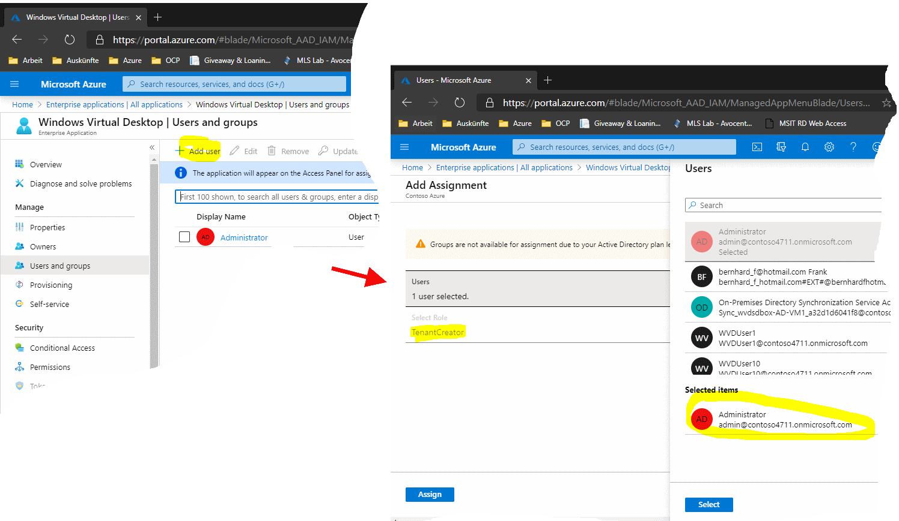

# Challenge 2: Do 2x Admin Consent & Give Tenant Creator Permissions

[back](../README.md) 
  
Congratulations! You made it through the prerequisite phase. Now we start with Windows Virtual Desktop Setup.  
In the setup flow we are at position:  
  
  
In this challenge you will...  
**A.** give consent to the WVD applications  
**B.** assign a _Tenant Creator_ user in your AAD.  

See also Azure [Tutorial: Create a tenant in Windows Virtual Desktop](https://docs.microsoft.com/en-us/azure/virtual-desktop/) 
  
## A. Grant Azure AD (AAD) Consent  
**Why? or what is a consent** you may ask:  
The _consent_ is a process (with a dialog) where **an AAD administrator allows access of an application to his AAD**.  
**Which** access (**permissions**)? Well this differs from application to application. An **administrator should** read and **think** whether he **should grant the requested permissions to the app or not**.  
In the **context of WVD** the AAD **admin** needs to **give consent to 2 WVD applications** which seek different permissions to your AAD. The **consent process is launched** by **browsing to a specific URI** - logged in (to Azure) as global administrator.  
  

#### Admin Consent 1: Windows Virtual Desktop _server_ app
- **Copy & paste** the following URI into **notepad**:
`https://login.microsoftonline.com/{tenant}/adminconsent?client_id=5a0aa725-4958-4b0c-80a9-34562e23f3b7&redirect_uri=https%3A%2F%2Frdweb.wvd.microsoft.com%2FRDWeb%2FConsentCallback`

- **Edit the _{tenant}_** field in this URI. Put here the **name of your AAD**. (in my case _contoso4711.onmicrosoft.com_)

- Browse to the **edited URI** using a **private browsing** (aka _incognito_ mode) session. Logon using your AAD user with global administrator rights.  
  
  
The result should be:
|  |  |  | 
|--|--|--|
| The **consent dialog** - please **accept** | success? Wait a second then... | ...verify `[Azure Portal] -> Azure Active Directory -> Enterprise Applications` |

#### Admin Consent 2: Windows Virtual Desktop _client_ app
- **Copy & paste** the following URI (note: different client_Id than above) into **notepad**:
`https://login.microsoftonline.com/{tenant}/adminconsent?client_id=fa4345a4-a730-4230-84a8-7d9651b86739&redirect_uri=https%3A%2F%2Frdweb.wvd.microsoft.com%2FRDWeb%2FConsentCallback`

- **Edit the _{tenant}_** field in this URI. Put here the **name of your AAD**. (in my case _contoso4711.onmicrosoft.com_)

- Browse to the **edited URI** using a **private browsing** (aka _incognito_ mode) session. Logon using your AAD user with global administrator rights. 

|  |  |  | 
|--|--|--|
| The _other_ **consent dialog** - please **accept**. This app requests **different permissions** | success? Wait a second then... | ...verify `[Azure Portal] -> Azure Active Directory -> Enterprise Applications`. This is the **client app**|

## B. Assign A TenantCreator To A User  
For [Challenge3](../Challenge3/README.md) **we need a user that is allowed to _create a WVD Tenant_**. To do so navigate to:  
`[Azure Portal] -> Azure Active Directory -> Enterprise Applications -> Windows Virtual Desktop`  

|  |  |
|--|--|
| Hit **Assign users and groups** |  Click **Add user** and select e.g. **Administrator** for the **TenantCreator** role. **Assign**|  

**Congrats! you successfully registered the required apps. This has to be done only once (per AAD).** 
  
[back](../README.md)    