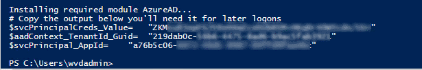
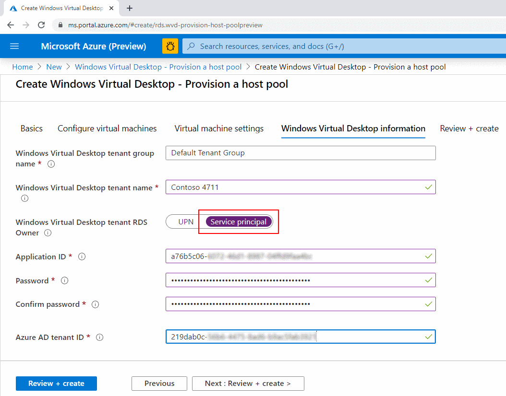

# [optional] Challenge 4: Create a Service Principal for WVD Administration

[back](../README.md)  
  
You are here:  


A service principal for WVD can help you to automate tasks or is an alternative if your AAD requires multi-factor authentication.
Check out [Create service principals and role assignments by using PowerShell](https://docs.microsoft.com/en-us/azure/virtual-desktop/create-service-principal-role-powershell)  
What would you like to automate? E.g. Host Pool creation, draining session hosts after business hours.

**RDP into your jumpserver**:  
```
Internet ---RDP---> wvdsdbox-FS-VM1 (Public IP)
```  
And c**opy & Paste the following code into a PowerShell ISE script window**.  
When you run **the code will create a Service Principal in your AAD and give it RDS owner permissions on the WVD tenant**:

```PowerShell
# Import (install) required AzureAD module
if ($(Get-Module -Name AzureAD -ListAvailable) -eq $null) {Write-Output 'Installing required module AzureAD...'; Install-Module -Name AzureAD -Force}
Import-Module -Name AzureAD

$aadContext = Connect-AzureAD        # Logon to the AAD where your Windows Virtual Desktop Applications are registered. logon as global administrator 
$svcPrincipal = New-AzureADApplication -AvailableToOtherTenants $true -DisplayName "Windows Virtual Desktop Svc Principal"
$svcPrincipalCreds = New-AzureADApplicationPasswordCredential -ObjectId $svcPrincipal.ObjectId

Write-Output "# Copy the output below you'll need it for later logons"
"`$svcPrincipalCreds_Value=`t`"{0}`" `n`$aadContext_TenantId_Guid=`t`"{1}`" `n`$svcPrincipal_AppId=`t`"{2}`"" -f $svcPrincipalCreds.Value, $aadContext.TenantId.Guid, $svcPrincipal.AppId
  
Add-RdsAccount -DeploymentUrl "https://rdbroker.wvd.microsoft.com"       # Logon as your Tenant Creator user
$tenantName = (Get-RdsTenant | Out-GridView -Title 'Select Your WVD Tenant' -OutputMode Single).TenantName

New-RdsRoleAssignment -RoleDefinitionName "RDS Owner" -ApplicationId $($svcPrincipal.AppId) -TenantName $tenantName
Get-RdsRoleAssignment -TenantName $tenantName | ft TenantName, AppId, ObjectType, SignInName, RoleDefinitionName

```  
The result should be the following:  
| 1. | 2. | 3. |
|--|--|--|
|   |  |  |
| 1st output of the PowerShell code. **Copy & store for later use** (e.g. in [Challenge5](../Challenge5/README.md) see screenshot below).  | Verify here: `[Azure Portal] --> Azure Active Directory --> App registrations` | 2nd output: **See that your Service Principal has owner rights on your tenant**  |  

**PS:** You could now c**reate a Host Pool using the Service Principals Credentials** - rather than those from a user:
  
see next [Challenge5](../Challenge5/README.md) for further details.  
  
**Congrats! You successfully created an Azure Service Principal for WVD administration.**  


[back](../README.md) 