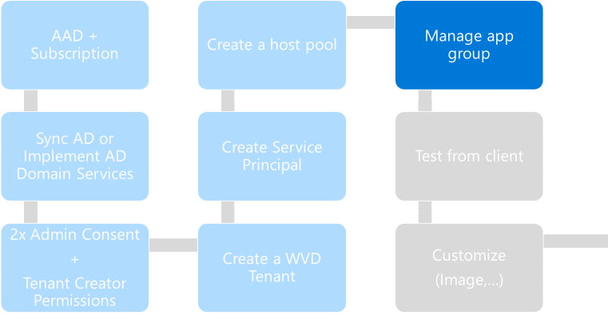

# Challenge 6: Manage Application Group

[back](../README.md)  
  
You are here:  
  
  
**Before a user can connect to a desktop** | application - **they must have** been given **the permission** to.  
So this challenge is about managing access by **configur**ing **a WVD Application Group**.

See also [Tutorial: Manage app groups for Windows Virtual Desktop](https://docs.microsoft.com/en-us/azure/virtual-desktop/manage-app-groups)  

## Add Users From AAD To The (default) Desktop Application Group  
The hostpool in the previous challenge was created through the Azure portal. **Most** other **admin tasks for WVD need** to be done using **PowerShell** (**Version <= 5.1**   - note: currently pscore not supported).  
**RDP into your jumpserver**:  
```
Internet ---RDP---> wvdsdbox-FS-VM1 (Public IP)
```  
and **open PowerShell ISE as Administrator and copy & paste the following code**:  
```PowerShell
Import-Module -Name Microsoft.RDInfra.RDPowerShell 

#Sign in to Windows Virtual Desktop
$azureCredential = Get-Credential -Message "Please Enter Your AAD Tenant Creator Credentials"   #in my case admin@contoso4711.onmicrosoft.com
Add-RdsAccount -DeploymentUrl "https://rdbroker.wvd.microsoft.com" -Credential $azureCredential   

#Make Some Selections
$tenantName = (Get-RdsTenant | Out-GridView -Title 'Select Your WVD Tenant' -OutputMode Single).TenantName

$hostPoolName = (Get-RdsHostPool -TenantName $tenantName | Out-GridView -Title "Select Your Host Pool" -OutputMode Single).HostPoolName

$AppGroupName = (Get-RdsAppGroup -TenantName $tenantName -HostPoolName $hostPoolName | Out-GridView -Title "Select your app group" -OutputMode Single).AppGroupName 


#Add Users From AAD To App Group
if (!(get-module azuread -ListAvailable)) {Install-Module AzureAD -Force}
Connect-AzureAD -Credential $azureCredential
$users = @()
Get-AzureADUser -All $true | Out-GridView -Title "Add (multiple) Users To Apllication Group: $AppGroupName" -OutputMode Multiple | %{$users += $_.UserPrincipalName}  
$users | % { Add-RdsAppGroupUser -TenantName $tenantName -HostPoolName $hostPoolName -AppGroupName $AppGroupName -UserPrincipalName $_}

#Output All Users Now That Have Access To This App Group
"The App Group: '$AppGroupName' contains the users: '{0}'" -f $($(Get-RdsAppGroupUser  -TenantName $tenantName -HostPoolName $hostPoolName -AppGroupName $AppGroupName ).UserPrincipalName -join ', ')  

```  
Some screenshots:  
| 1. | 2. | 3. |
|--|--|--|
|   |  |  |
| Login using **your WVD Tenant Creator** _(in my case admin@contoso4711.onmi...)_  | **Select WVD Tenant, HostPool and Application Group**  | **Select Users to Add**  |
## Result...
will be that the **users** you **have** added now have **access** **to** the default **Desktop Application Group**, i.e. they can now connect to the virtual desktop (see [Challenge7](../Challenge7/README.md))

**Congrats! You successfully allowed users to access a WVD published desktop.**

> **PS:** The following **code removes users from the application group**:  
```PowerShell
#remove users from AAD from app group
$appGroupUsers = @()
Get-RdsAppGroupUser -TenantName $tenantName -HostPoolName $hostPoolName -AppGroupName $AppGroupName | Out-GridView -Title "Select users to remove from app group" -OutputMode Multiple | %{$appGroupUsers += $_.UserPrincipalName}
$appGroupUsers | %{  Remove-RdsAppGroupUser -TenantName $tenantName -HostPoolName $hostPoolName -AppGroupName $AppGroupName -UserPrincipalName $_}  

```


[back](../README.md)  