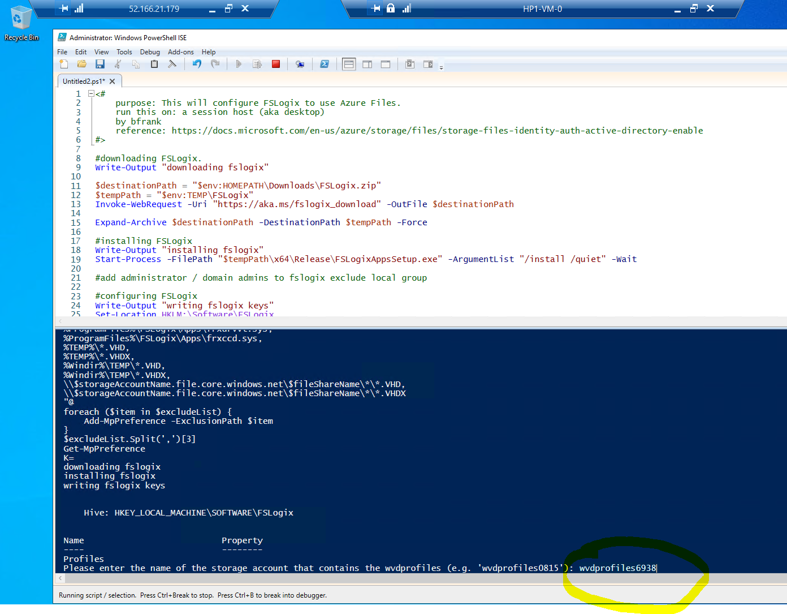
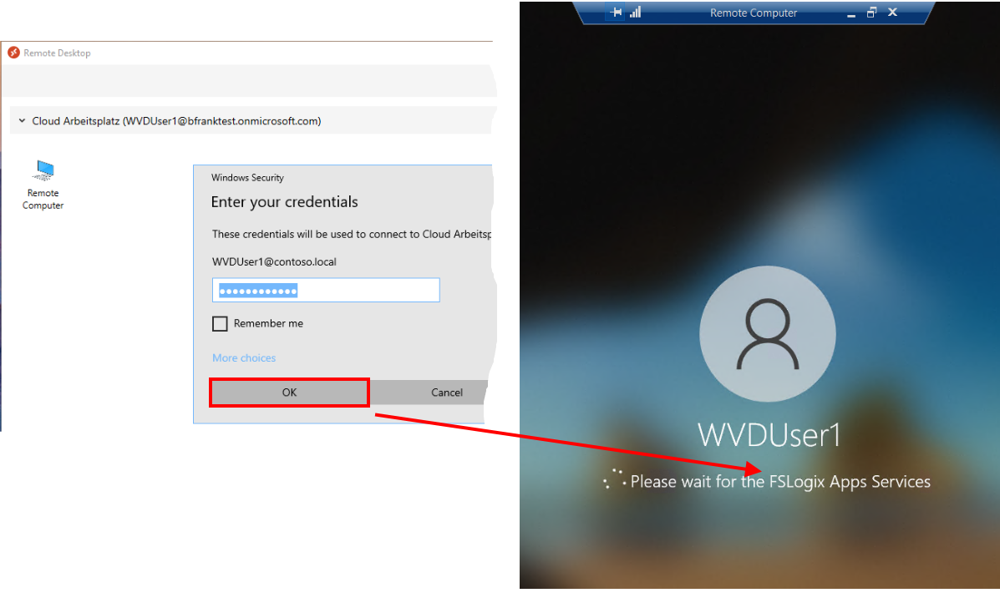
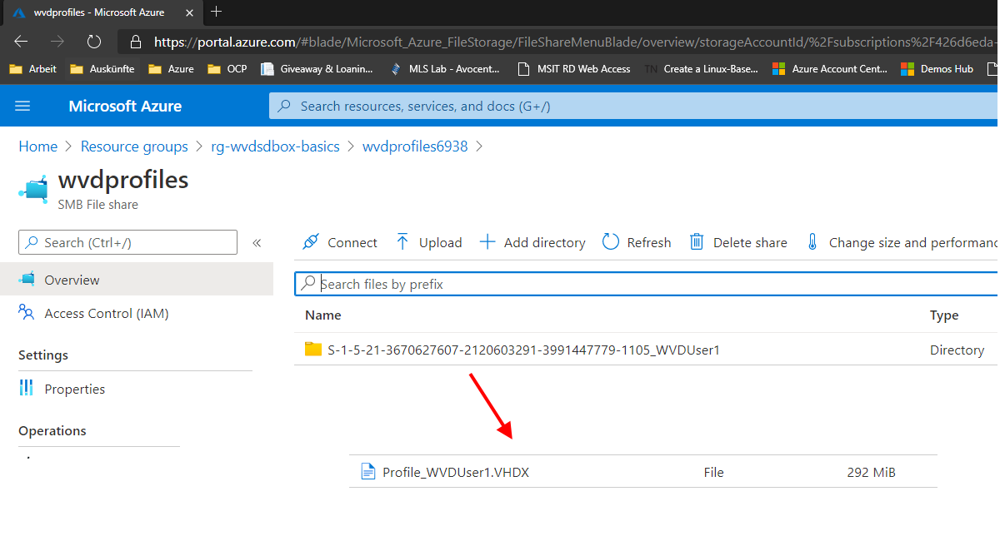
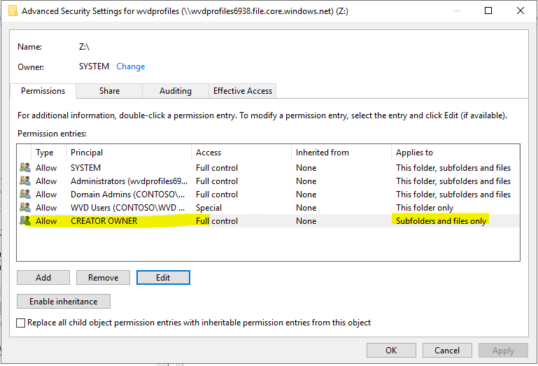
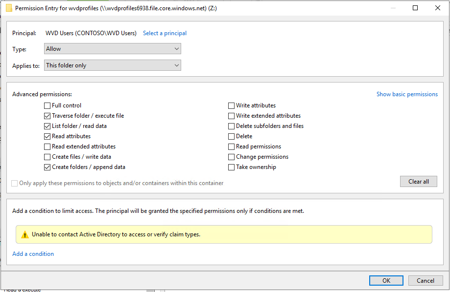

# Challenge X: Use Azure Files with AD Auth for FSLogix Profile Redirection.

[back](../../README.md)

[**FSLogix**](https://docs.microsoft.com/en-us/fslogix/overview) and it's software solutions **was aquired by Microsoft**.  
**One** of the **key feature**s was:  
- "...[**Redirect user profile**s to a network location using Profile Container. Profiles are placed in VHD(X) files and mounted at run time. ](https://docs.microsoft.com/en-us/fslogix/overview#key-capabilities)..."  
  
So, when properly configured **a user's files _follow him_ whereever he logs on to**.  
**Good** for Terminal Server scenarios **when users are sharing a pool of machines** - not guaranteed to always log on to the same machine.  
This is **transparent for the user**. To her it seems that her files (in pictures, documents, downloads,...) are stored locally - however in reality the are persisted on a central location accessible over the network.  
  
Here are the **common profile storage locations for WVD**:  

| FSLogix profile location | Annotations |
|---|---|
| **Azure File Share** | Azure PaaS service, uses SMB protocol with NTFS permissions in conjunction with:<ul><li>[(my own) AD](https://docs.microsoft.com/en-us/azure/virtual-desktop/create-file-share)</li><li>or [Azure AD DS](https://docs.microsoft.com/en-us/azure/virtual-desktop/create-profile-container-adds)</li></ul> - good start. When using Azure Files Premium - performance scales with provisioned space |
| [Azure NetApp Files](https://docs.microsoft.com/en-us/azure/virtual-desktop/create-fslogix-profile-container) | SMB, contains 3rd party (=NetApp) - 4TiB (minium) - offers low latency & good scaling |
| [VM based File Share](https://docs.microsoft.com/en-us/azure/virtual-desktop/create-host-pools-user-profile) | VMs in Azure e.g. using Storage Spaces Direct in Windows Server. Negative: admin overhead. |  
  
  

I'll demonstrate **how to use an Azure File Share for WVD** / FSLogix Profile Folder - **The steps are**:
1. **Download** the **PowerShell modules** required **for making an Azure File Share join your Domain**.
2. **Create the Azure Files Premium share**.
3. **Make this file share AD joined using PowerShell** and the modules you have installed in 1.
4. **Mount the file share** (as drive) once using the storage accounts access key.
5. **Assign required NTFS permissions** to the WVD users group.
6. **Install & configure FSLogix** in the session host VM to use the share.

## **1. Download** the **PowerShell modules** required **for making an Azure File Share join your Domain**.
Please copy and run the following [**Step1.ps1 script**](./Step1.ps1) on a member server (or the DC).  
It'll update the PowerShell package manager and download the required modules + the AzFilesHybrid module.

##  **2. - 5. Actions** are performed by running the 2nd script
Please copy and run the 2nd script [**Step2.ps1**](./Step2.ps1) on the same server you used in 1.
This script will perform steps 2. to 5. You'll be asked to login to your azure subscription to create a storage account and file share.
Once successful you should see a file share mounted as Z: drive - and in the Azure Portal you should see a new storage account with an premium file share.

## **6. Install & configure FSLogix** in the session host VM to use the share.
Logon to a WVD session host as administrator via the jump server:  
```
Internet ---RDP---> wvdsdbox-FS-VM1 (Public IP) ---RDP---> e.g. HP1-VM-0 (which you have created in Challenge 4)
```   
Please **copy & paste (PowerShell ISE) and run the 3rd script [**Step3.ps1**](./Step3.ps1) to e.g. HP1-VM-0**.  
You will be asked enter the storage account name that contains the wvdprofiles folder:  
```
[Azure Portal] -> Resource Groups 'rg-wvdsdbox-basics' -> "wvdprofilesXXXX" 
```  
  
  
(You might need to restart the vm to make things work.)


## **7. Test**
| Login as e.g. WVDUser1 and what if you see fsloxix components loaded in the login screen.   | Once successful logged in you should see a *.vhdx file in a user subfolder on the azure file share:   |
|--|--|
|  |  |


## **Troubleshooting**
In case this doesn't work - log on as administrator to the hostpool vm (via the jumpserver) like you did in 6. and navigate to the following log path:  
**_%ProgramData%\FSLogix\Logs\Profile_**  
There are a lot of other log and trace settings you can do to troubleshoot - refer to [Logging and diagnostics](https://docs.microsoft.com/en-us/fslogix/logging-diagnostics-reference)

## **Notes & Links**
[**Step2.ps1**](./Step2.ps1) **sets** the **following NTFS permissions on the Azure File share** (e.g. 'Z:' in our case) - hence **a user** e.g. WVDUser1 (in group WVD Users) **can create a** sub**folder** (where the **profile** goes) **but cannot look into the folders of the other users**!  
The NTFS permissions on the azure file share are:
|CreatorOwner| WVDUsers Group|
|--|--|
| | |
|**only on subfolder & files**|**only on top folder**|  
  
 ### Links: 
- [**Add FSLogix Profile Container** - on Christian Brinkhoff's site](https://christiaanbrinkhoff.com/2020/05/01/windows-virtual-desktop-technical-2020-spring-update-arm-based-model-deployment-walkthrough/#AddFSLogixProfileContainerasprofiledeliverysolution)  
- [Tutorial: Configure Profile Container to redirect User Profiles](https://docs.microsoft.com/en-us/fslogix/configure-profile-container-tutorial)

[back](../../README.md)